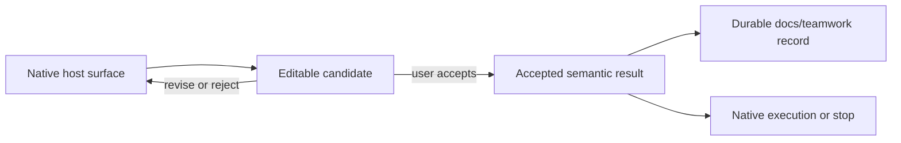
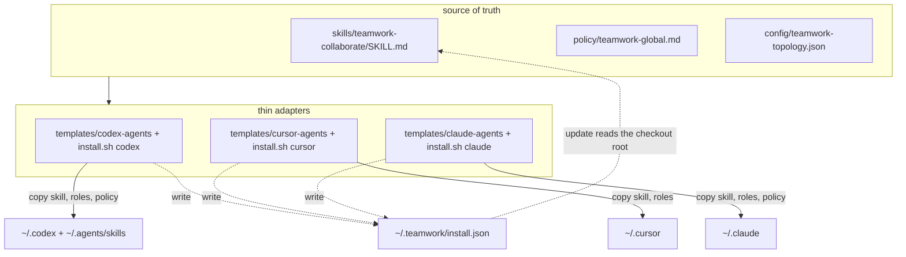

# Teamwork Architecture

Teamwork installs into two physically different layers of a host. The split
is not a style choice — it is the reason the product works at all, and it
is the reason the previous, larger version of this product (eight Skills,
five of them duplicating native host modes) did not: a rule written into a
Skill's body is invisible except at the moment that Skill happens to load,
and a method written into the always-loaded layer would cost every thread
in every project the full weight of a workflow it might never use.

## The two layers

**Standing layer — `policy/teamwork-global.md`.** The installer writes this
file, whole, into `~/.codex/AGENTS.md`, `~/.claude/CLAUDE.md`, and (as a
block the user pastes into) Cursor User Rules. It is read on every thread,
in every project, whether or not the user ever mentions Teamwork. That
constant cost means it can only carry rules that must hold before any
method loads: advance clear work immediately, own the produce-transform-
consume path you change, do not fabricate a result, and the minimum bridge
that tells Root when to look for a Skill and when an accepted result gets
written down. Anything project-specific, task-specific, or verbose does not
belong here — it is paid for by every thread that never needs it.

**On-demand layer — `skills/teamwork-collaborate/SKILL.md`.** A Skill has
two parts with two different costs. Its frontmatter `description` is
always resident, used only for routing: the host keeps every installed
Skill's description in context so it can decide whether the current
request matches. The Skill's body — the actual method — loads only when
that description's trigger matches and the host pulls the file in. That
means the body is the only safe place for "how to do this class of task":
the method that carries a question from decision surface to settled
direction to executable plan to parallel split and Worker dispatch, plus
its templates and its persistence contract. Writing a standing constraint into
a Skill body is equivalent to not writing it: it binds nothing until the
Skill happens to load, which is exactly the failure this redesign removes.

Putting a rule in the wrong layer either taxes every thread that never
needs it (rule in the standing layer that only one task type needs) or
silently fails to bind most of the time (constraint in a Skill body that
should hold everywhere). The eight-Skill predecessor of this product put
plan/review/research/debug/goal contracts in Skill bodies specifically
because hosts had no native equivalent yet; once Codex Plan, Cursor
Plan/Debug/Explore, and Claude Plan mode/Explore covered the same ground
natively, those five Skills became a second, competing implementation of a
capability the host already owned — so they were deleted rather than kept
running alongside the native surface. **When a host gains native capability
that covers a Teamwork contract, the Teamwork surface is removed, not kept
as a parallel path.** That disposal rule is not new to this redesign; it
existed in the predecessor's architecture doc too. What is new is that it
was actually carried out: five of eight Skills are gone, not deprecated in
place.

## Runtime flow

1. Root reads the request and the repository's own instructions.
2. Clear, authorized work stays native and proceeds directly.
3. `teamwork-collaborate` loads only when its own description's trigger
   matches — a direction genuinely needs to be discussed, settled, and
   turned into parallel, dispatched, verified work.
4. Root may delegate a bounded, independent piece of that work to
   Challenger, Worker, or Writer when doing so is useful; none of the three
   is required for the Skill to run.
5. Root integrates whatever came back, does the authorized work, and
   verifies the outcome in proportion to the claim.

There is no router, mandatory stage chain, readiness preflight, document
schema, case lifecycle, or automatic update detour.

## Source ownership

| Surface | Owns | Does not own |
| --- | --- | --- |
| `policy/teamwork-global.md` | cross-project working rules that must hold before any Skill loads, and the minimum routing/delegation/persistence bridge | host tool names, the collaborate method's stages, document templates |
| `docs/architecture.md` | the closed document-kind set, path shape, the two-layer split and why it exists | cross-project working rules, host tool names |
| `skills/teamwork-collaborate/SKILL.md` | the method itself, its checkpoints, template paths, and write timing | generic working rules, the Writer contract |
| `skills/teamwork-collaborate/references/*.md` | fill the method's document templates | teaching prose, generic rules |
| `CODEX.md` / `CURSOR.md` / `CLAUDE.md` | host install steps, native-capability mapping, host-local paths that are not Teamwork persistence | cross-project working rules |
| `README.md` / `README.en.md` | user-visible outcomes | mechanism restatement |
| `config/teamwork-topology.json` | the Skill/role/template inventory the installer reads | working rules, method content |
| `config/teamwork-facts.yaml` | the small set of facts (document kinds, host counts, path shapes) repeated across docs | everything the facts feed into |

`policy/teamwork-global.md` is the sole owner of cross-project working
rules; a rule an owning Skill body already states does not belong there,
and no other file restates it.

## Native interaction to durable record

Native host interaction stays in charge: Plan UI, question UI, Debug, and
approval remain host surfaces. The path is native interaction, an editable
candidate, the user's acceptance, then a durable record — never the other
order.

Entering a host surface — opening Plan mode, starting a question batch — is
not acceptance and does not by itself complete a checkpoint. After the user
accepts a reusable result, Root writes it in the same response cycle;
Writer may help but must not delay that write, and if the environment is
read-only, Root reports the exact path that was not delivered instead of
pretending it was. A later accepted change to the same stable identity
updates that document and appends to its History; it never rewrites an
accepted entry in place. When the host surface and the durable record
diverge, the latest user-accepted delta wins — not whichever file has the
newer timestamp.

## The four document kinds

Checkpoint documents are one of four kinds, at
<!-- BEGIN GENERATED: kind-root -->
`docs/teamwork/<kind>/`
<!-- END GENERATED: kind-root -->
The set is closed: nothing invents a fifth kind, and nothing writes a
checkpoint at the `docs/teamwork/` root. Each document is plain Markdown
with a current synthesis at the top and an append-only chronological
History at the bottom; the same stable identity reuses the same path,
which defaults to
<!-- BEGIN GENERATED: checkpoint-path -->
`docs/teamwork/<kind>/<slug>.md`
<!-- END GENERATED: checkpoint-path -->
<!-- BEGIN GENERATED: kind-meanings -->
The four meanings are:

- Discussion (`discussions/`): options, trade-offs, settled choices, rejected alternatives, and open questions;
- Plan (`plans/`): executable steps, dependencies, parallel lines and Worker dispatch, verification, and stop conditions for a selected direction;
- Record (`records/`): reusable results, conclusions, and blockers that carry across sessions;
- Experiment (`experiments/`): one trial's claim, setup, actual run, result, and conclusion.
<!-- END GENERATED: kind-meanings -->

A discussion that resolves into a direction and a plan for it are not the
same document: the discussion's identity is the decision, the plan's
identity is the selected direction's execution. Ordinary local
investigation that only serves one plan stays inside that plan; it does
not get its own discussion identity. `docs/teamwork/INDEX.md` is derived
from these files by `python3 scripts/teamwork-index.py`; it is never a
source of truth, and nothing treats it as a workflow gate.

## Agent handoff

Every handoff — to Challenger, Worker, or Writer — carries the same five
fields, no more:

- objective;
- owned scope;
- settled constraints;
- available evidence;
- requested return.

Helpers do not own the user dialogue, and a missing role never blocks
native work.
<!-- BEGIN GENERATED: host-counts -->
Codex, Cursor, and Claude Code install the same footprint: 1 Skill and 3 optional roles. No host omits a role or the Skill.
<!-- END GENERATED: host-counts -->
Reviewer stays out of this product's role set entirely: an independent
read-only check is either done by the host's own review surface (Claude
Code's `code-review`, for example) or, when the user specifically requires
independence and none is available, Root says so instead of pretending a
non-independent check is independent.

## Installation surface and the source pointer

- `skills/` owns behavior; there is exactly one Skill.
- `templates/*-agents/` owns the three optional role profiles per host.
- `scripts/install/` owns installation mechanics.
- `~/.teamwork/install.json` records which checkout `./install.sh update`
  and `init-project` read from, so a refresh does not depend on the
  working directory at refresh time.

## Verification

`./scripts/validate.sh` runs the small local smoke suite; use
`--release` only during explicit release preparation. Tests and installed
markers never substitute for reading the actual result.
